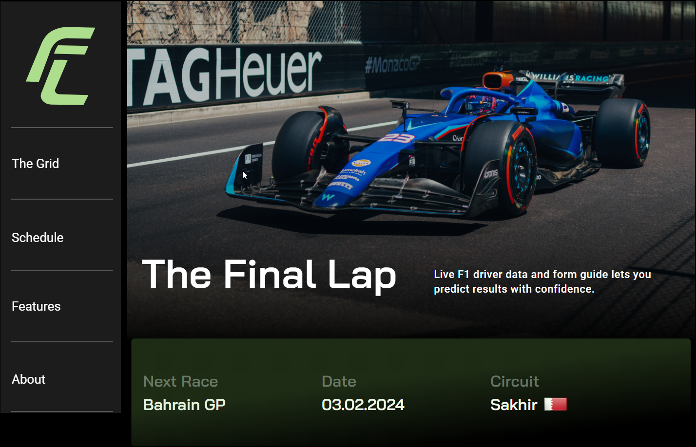
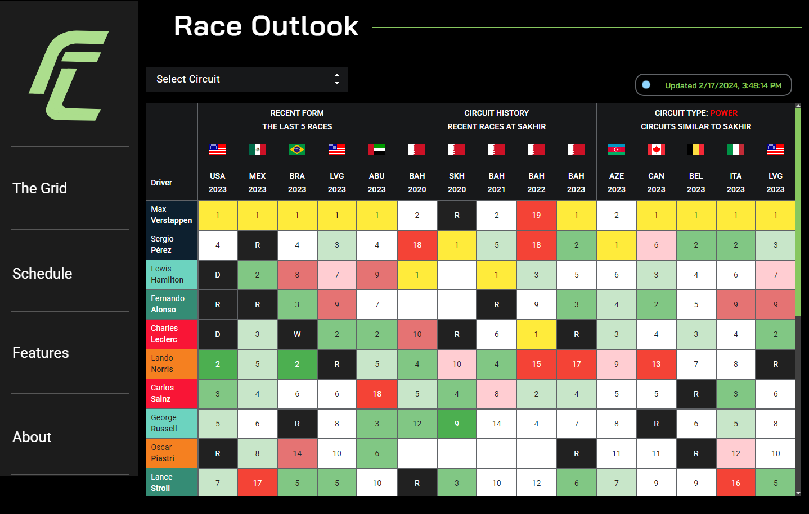
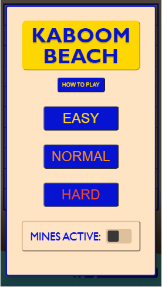
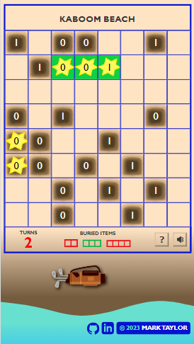

<h1 align="center">Hi 👋, I'm Mark</h1>

## Why I'm Here
- 👩‍💻 I am a software developer who has been a student at Get Coding since April 2023. I am passionate about learning new things, building challenging projects, and I am eager to transition my career into the tech industry!
- 🏁 My most recent project is a Formula 1 data tool called "The Final Lap". I made it with the goal of helping old and new fans alike predict race outcomes and learn about my favourite sport. It's built with React.js, and I will soon be doing back-end work with it. Check it out [here](https://marktaylor7.github.io/TheFinalLap/).
- :beach_umbrella: My first Get Coding project was a puzzle game called "Kaboom Beach". This was built with HTML, CSS, and JavaScript. You can play Kaboom Beach [here](https://marktaylor7.github.io/KaboomBeach/), but remember to check your volume first (the exploding mines can be...startling).
- 🌐 I am currently learning back-end development and databases (Node.js, Express and MySQL).
- 💻 I am also doing some freelance web development for a local cabinet maker who wants a professional-looking site to showcase his work and promote his services. Planned features include a photo gallery, client testimonials, and payment processing. This site will be built with React.js.

## Who I Am
- 🚘 My most recent career was in automotive, where I held positions at BMW St. John's as Sales Consultant, Product Genius, and Assistant Service Manager.
- :books: Bachelor of Arts (Psychology) - Memorial University of Newfoundland, 2016
- :tennis: My interests and hobbies include: long distance running, hiking, tennis, video games, film/TV, reading, hockey, Formula One...and coding!
- :family: Proud father of two: one human and one pug.

## Projects (What I've built)
- [The Final Lap](https://marktaylor7.github.io/TheFinalLap/) 
A Formula 1 data tool that provides historical and in-season results relevant to the next F1 race.
Data analysis of driver/team performance and circuit characteristics enable fans to make informed choices when placing a bet or building a fantasy team.
I will be using what I learn in Get Coding's back-end module to develop additional features for this project.  

- [Kaboom Beach](https://marktaylor7.github.io/KaboomBeach/) 
A puzzle game that combines elements of Battleship and Minesweeper.
Features randomly generated layouts, two game modes, difficulty settings, sound effects, animations.  

- Chris’ Cabinets 
*Under development* 
A landing page that I’m building for a local cabinet-maker. Planned features include a photo gallery, client testimonials, and payment processing. This site will be built with React.js.

## What I Know

## Where You Can Find Me
- :link: [LinkedIn](https://www.linkedin.com/in/marktaylor27/)
- ✉️ mtaylor.091@gmail.com

